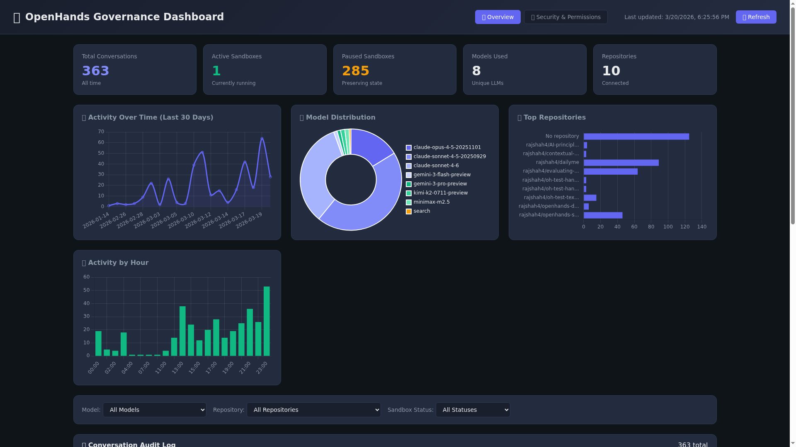
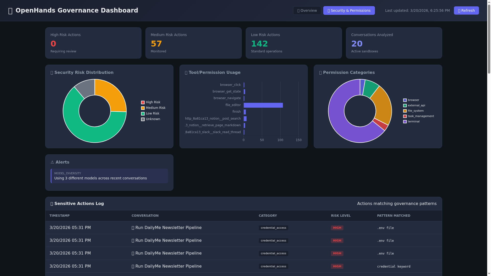

# OpenHands Governance Dashboard

A comprehensive governance and security monitoring dashboard for OpenHands AI agent conversations.

## Screenshots

### Overview Tab


### Operations Tab
Operations observability is included in the dashboard and surfaces background-job activity, trigger sources, automation runs, and parent/subagent lineage where available.

### Security & Permissions Tab


## Features

### 📊 Overview Tab
- **Total Conversations** - Track all agent conversations over time
- **Active/Paused Sandboxes** - Monitor resource usage and costs
- **Model Distribution** - See which LLMs are being used
- **Repository Activity** - Track which codebases agents interact with
- **Activity Trends** - 30-day usage patterns and hourly distribution
- **Conversation Audit Log** - Searchable, filterable list of all conversations

### 🧭 Operations Tab
- **Background Job Monitoring** - Track automation, resolver, and Slack-triggered conversations
- **Running and Recent Jobs** - See active work plus a 24-hour morning review queue
- **Automation Run Breakdown** - Count distinct automation runs and top automation names
- **Trigger Visibility** - Break down background work by trigger source
- **Lineage Tracking** - Surface parent/child conversation links and observed subagents
- **Operational Telemetry** - Review repository, status, cost, and token usage per job

### 🔒 Security & Permissions Tab
- **Risk Distribution** - Visualize HIGH/MEDIUM/LOW risk actions
- **Tool Permission Usage** - Track which tools agents are using
- **Sensitive Actions Log** - Detect and flag potentially risky operations
- **Permission Categories** - Breakdown by file_system, terminal, browser, external_api
- **Real-time Alerts** - Anomaly detection and warnings

## Governance Capabilities

### Security Risk Levels
Every agent action is tagged with a security risk level:
- **HIGH** - Requires review (data exfiltration, privilege escalation)
- **MEDIUM** - Monitored (file modifications, terminal commands, external APIs)
- **LOW** - Standard operations (read-only actions, browser navigation)

### Sensitive Pattern Detection
Automatically detects operations matching governance patterns:
- `credential_access` - Access to secrets, tokens, keys, .env files
- `system_modification` - rm -rf, chmod, sudo, package installations
- `network_access` - curl, wget, ssh, external URLs
- `data_exfiltration` - base64, uploads, POST requests with data
- `destructive_operations` - DROP TABLE, DELETE, format, shred

### Permission Categories
Tools are categorized for governance tracking:
- **terminal** - Shell/bash commands
- **file_system** - File read/write/edit operations
- **browser** - Web navigation and interaction
- **external_api** - Slack, Notion, GitHub, GitLab integrations
- **code_execution** - Running Python, Node.js code

## Quick Start

### Prerequisites
- Python 3.8+
- OpenHands API Key (set as `OH_API_KEY` environment variable)

### Installation

```bash
# Clone the repository
git clone https://github.com/rajshah4/openhands-governance-dashboard.git
cd openhands-governance-dashboard

# Install dependencies
pip install flask flask-cors requests

# Set your API key
export OH_API_KEY="your-openhands-api-key"

# Run the dashboard
python app.py
```

### Access the Dashboard
Open http://localhost:12000 in your browser.

## API Endpoints

### Overview APIs
| Endpoint | Description |
|----------|-------------|
| `GET /api/stats` | Aggregated governance statistics |
| `GET /api/conversations` | Paginated conversation list |
| `GET /api/conversation/{id}` | Single conversation details |
| `GET /api/filters` | Available filter options |
| `GET /api/refresh` | Force refresh conversation data |

### Operations APIs
| Endpoint | Description |
|----------|-------------|
| `GET /api/operations/overview` | Morning-review summary of background jobs, triggers, automation runs, and lineage |

### Security APIs
| Endpoint | Description |
|----------|-------------|
| `GET /api/security/overview` | Security analysis across active conversations |
| `GET /api/security/conversation/{id}` | Detailed security analysis for one conversation |
| `GET /api/security/alerts` | Current alerts and anomalies |
| `GET /api/governance/permissions` | Tool/permission usage summary |

## Architecture

```
governance-dashboard/
├── app.py              # Flask backend API
├── static/
│   └── index.html      # Single-page dashboard frontend
├── conversations_cache.json  # Persisted API cache for cold starts
└── README.md
```

## OpenHands API Integration

This dashboard uses the OpenHands V1 API:
- **App Server** (`https://app.all-hands.dev/api/v1/`) - Conversation management
- **Agent Server** (per-sandbox) - Event analysis and security scanning

## Use Cases

### For Governance Teams
- Audit AI agent activity across the organization
- Track which models and repositories are being accessed
- Monitor for sensitive operations and policy violations
- Generate compliance reports

### For Security Teams
- Detect potential data exfiltration attempts
- Monitor credential access patterns
- Track external API integrations
- Set up alerts for high-risk actions

### For Platform Teams
- Monitor sandbox resource usage
- Optimize costs by tracking active vs paused sandboxes
- Analyze usage patterns for capacity planning
- Review scheduled and background agent activity every morning
- Inspect automation lineage and subagent fan-out

## Contributing

Contributions welcome! Please open an issue or PR.

## License

MIT License - see LICENSE file for details.
